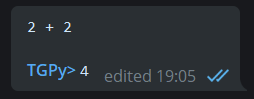
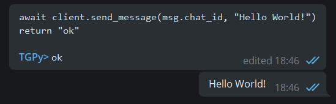
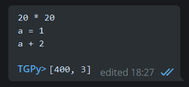
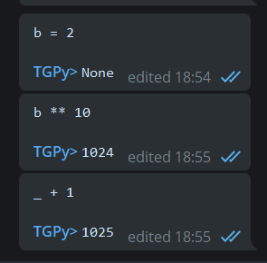
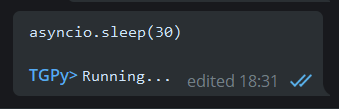

## Run Python code right in your Telegram messages

Made with Telethon library, TGPy is a tool for evaluating expressions and Telegram API scripts.


# Installation
1. Get your Telegram API key on [my.telegram.org](https://my.telegram.org)
2. Clone the repo
   ```shell
   > git clone https://github.com/tm-a-t/TGPy
   ```
3. Create `config.py`
   ```python
   api_id = ...
   api_hash = ...
   phone = ...
   ```
4. Install the requirements and run TGPy
   ```shell
   > pip install -r requirements.txt
   > python -m app
   ```
5. Log in with a confirmation code from Telegram

# Usage

## Basics

Just send Python code to any chat, and it will be executed.



Change your message to change the result.

## Code detection

TGPy automatically detects and evaluates Python code in your messages.

Single constants/names are not evaluated. Instead, use `return something`.

**Cancel evaluation.** Reply `cancel` to your TGPy message to keep the original message.

**Prevent evaluation.** Write `//` in the beginning of your message to prevent evaluation.

## Interacting with chats, users, messages

TGPy uses [Telethon](https://github.com/LonamiWebs/Telethon) library for Telegram API. Refer to 
[Telethon documentation](https://docs.telethon.dev/en/latest/).

In TGPy expressions you can use some context variables:  
- `msg` - current [message](https://docs.telethon.dev/en/latest/quick-references/objects-reference.html#message)
- `orig` - original message if your message is a reply
- `client` - Telethon [client](https://docs.telethon.dev/en/latest/quick-references/client-reference.html)



## Returning values

The evaluation result is the returned value. If there is no `return`, all evaluated statements are returned.



## Saving variables

The locals are saved while TGPy is running. You can also use `_` variable to use the previous result.



## Asyncio

You can use `async`/`await` in your code. Also, the returned value is automatically awaited (if needed).



# License

MIT
